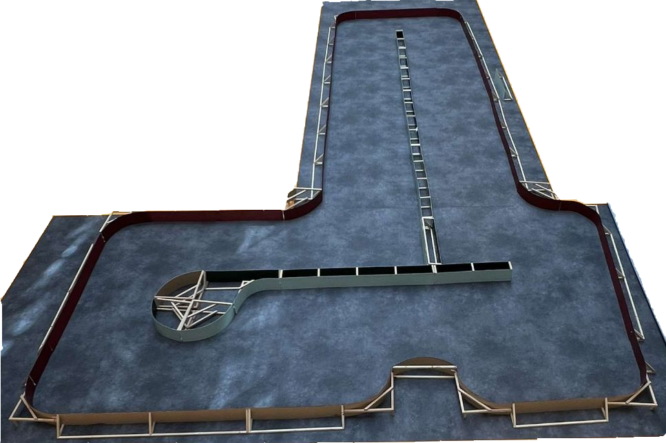

# Règlement de la course de voitures autonomes de Paris Saclay

Ce règlement évolue d'année en année, n'hésitez pas à ajouter vos contributions.

## Le véhicule

Le véhicule doit utiliser un kit châssis/moteur Tamiya TT02 et une batterie NiMH 7,2V 5000 mAh maximum. Il doit avoir une carrosserie le recouvrant à plus de 80 % (valeur estimée par le jury de manière peu scientifique...).
Le véhicule avec l’ensemble de ses capteurs et actionneurs doit entrer dans les dimensions ci-dessous :

La voiture doit être visible des véhicules qui la suivent : La voiture doit présenter à l’arrière au moins un rectangle plein de largeur 150 mm et de hauteur 110 mm. Seul un peu de vide (< 10 mm de haut), pour la garde au sol du véhicule est accepté.
Les carrosseries transparentes ou de couleur principale vert, rouge ou gris ne sont pas autorisées.
Un test avec un lidar RP-Lidar A2M8 valide la visibilité de l'arrière de la voiture. En cas de non détection (certaines peintures noires absorbent les infra-rouges), du scotch blanc cassé sera ajouté sur l'arrière de la voiture.

Il est possible de supprimer l'entraînement des roues avant au profit du rayon de braquage et au dépend de la motricité.

La voiture doit pouvoir fonctionner en marche avant et en marche arrière.

Pour améliorer la mécanique de la direction, il est possible de changer quelques pièces plastiques par les jeux de pièces en alu du commerce (Yeah Racing TATT-S03BU disponible notamment chez Rcmart.com ou kit Tamiya 54574 vendu chez Conrad).
Toute modification importante du châssis (au delà de quelques perçages) doit faire l’objet d’une demande et d’une acceptation par les autres écoles participant à la course. L’envoi doit comprendre les références ou plans des modifications prévues.

La communication de l’équipe avec le véhicule doit se limiter à l’envoi d’un signal de démarrage et d’un signal d’arrêt et de « non-arrêt ». Le véhicule peut envoyer des informations à l’équipe (Télémétrie). Envoyer des commandes modifiant le comportement du véhicule entraîne la disqualification de l’équipe.
Une batterie secondaire pour l’électronique est autorisée. Une alimentation du moteur avec une tension supérieure à la tension batterie n’est pas autorisée.

Une voiture type sera proposée en kit à partir de novembre 2022 normalement.

## La piste

La forme de la piste n’est pas connue avant le jour de la compétition. Donner des informations sur la forme de la piste à la voiture est interdit. Les arbitres peuvent demander de vérifier cela sur une piste annexe par exemple. La voiture peut apprendre la piste lors de ses premiers tours.

La piste est constituée de bordures de 200 mm de hauteur, vertes sur la droite dans le sens du déplacement et rouges sur la gauche. Ces bordures seront composées d'éléments droits et d'arcs de cercles de rayon de courbure R=400mm ou plus. Le sol est un lino de couleur grise. La piste est en tout point d’une largeur supérieure à 1000 mm, mais peut contenir des obstacles à l'intérieur.

Un marquage blanc continu est ajouté à partir de 2023 le long des bordures pour faciliter la vision. Une ligne pointillée est envisagée au milieu.

Référence des couleurs chez Leroy Merlin : 
* VERT : Peinture mur, boiserie, radiateur toutes pièces Multisupports LUXENS, cactus 6, Réf : 80042620
* ROUGE : Peinture bois extérieur / intérieur rouge basque satin LUXENS 2.5 l Réf : 82435037
* SOL : Sol PVC GERFLOR effet béton leone anthracite l.4 m  Réf 83309786
Le tracé n’est pas connu à l’avance. 

Voici comme exemple la piste 2022 :

Une piste sera proposée en kit à partir de novembre 2022 normalement.

## Homologations

48h avant la journée course, les équipes doivent envoyer un diaporama pdf de 4 diapositives présentant la voiture : schéma synoptique de la voiture, spécificités matérielles, méthode de navigation, outils IA utilisés,...
L’homologation consiste à une validation des éléments du véhicule (dimensions, batterie, châssis, démarrage et arrêt à distance, couleur détectable par un lidar...) et à la vérification de l’aptitude du véhicule à se déplacer sur un élément droit de piste sans toucher les bordures et à repartir en marche arrière en cas de blocage contre un obstacle.
Une homologation avec pénalité est envisageable, par l'ensemble des arbitres pour de légères infractions au règlement : un véhicule qui ne démarre pas ou ne s'arrête pas ou mal à distance, non fonctionnement de la marche arrière par exemple.

## Qualifications

Les qualifications se font sur une piste A, une voiture à la fois. Une première qualification a lieu sans obstacle. Une seconde qualification a lieu avec des obstacles fixes d’une taille supérieure à celle d’une voiture, toujours sur la piste A.
Pour chaque qualification, la voiture s’élance pour 2 tours. La voiture a, pour chaque qualification 2 essais et le meilleur des 2 temps est retenu, ceci pour palier à un problème technique par exemple survenu lors du premier essai.
En cas d'échec à terminer les 2 tours, 120s est compté.
Le résultat, somme des temps des 2 qualifications, détermine la grille de départ, la voiture la plus rapide s’élançant en tête sur la grille de départ.

## La course

Les équipes ont 3 mn pour installer leur véhicule sur la piste.
L’ensemble des véhicules seront positionnées sur la grille de départ selon les résultats des qualifications. Une fois que toutes les équipes ont annoncé être prêtes, il est interdit de toucher les véhicules. Le signal de départ est donné oralement par l’arbitre.
On relève l’ordre d’arrivée après un nombre de tours définis à l’avance (3 par défaut).
En cas de non achèvement de la course par une voiture, la distance parcourue sera relevée pour le classement.
La première course se déroule sur la piste A, identique à celle des qualifications.
La seconde course se déroule sur une piste B, qui peut être différente.
Un véhicule ne peut avoir un comportement notoirement agressif envers les véhicules adverses. Une voiture ne peut volontairement empêcher une autre de la doubler.
L’arbitre peut disqualifier un tel véhicule et le retirer de la piste.
L’arbitre ou l’un de ses assistants peut enlever un véhicule immobilisé sur la piste.