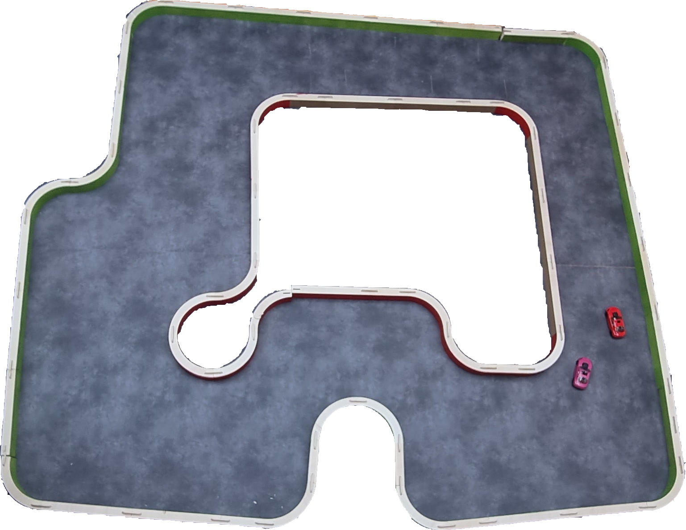

# Règlement de la Course de Voitures Autonomes de Paris Saclay CoVAPSy

Ce règlement évolue d'année en année, n'hésitez pas à ajouter vos contributions.

## Le véhicule

Le véhicule doit utiliser un kit châssis/moteur Tamiya TT02 et pour la propulsion une batterie NiMH 7,2V 5000 mAh maximum. Une batterie secondaire, peu importe le type, est autorisée pour alimenter l'électronique. Une alimentation du moteur avec une tension supérieure à la tension batterie n’est pas autorisée. Il doit avoir une carrosserie le recouvrant à plus de 80 % (valeur estimée par le jury de manière peu scientifique...).
Le véhicule avec l’ensemble de ses capteurs et actionneurs doit entrer dans les dimensions ci-dessous :

La voiture doit être visible des véhicules qui la suivent : la voiture doit présenter à l’arrière au moins un rectangle plein de largeur 150 mm et de hauteur 110 mm. Seul un peu de vide (< 10 mm de haut), pour la garde au sol du véhicule est accepté.
Les carrosseries transparentes ou de couleur principale verte, rouge ou grise ne sont pas autorisées. Des guides pour peindre la voiture sont disponibles sur Youtube (ex : https://www.youtube.com/watch?v=MO5J6AqEpbs). Un test avec un lidar RP-Lidar A2M12 ou A2M8 valide la visibilité de l'arrière de la voiture. En cas de non détection (certaines peintures noires absorbent les infra-rouges), du scotch blanc cassé sera ajouté sur l'arrière de la voiture.

Il est possible de supprimer l'entraînement des roues avant au profit du rayon de braquage et au dépend de la motricité.

La voiture doit pouvoir fonctionner en marche avant et en marche arrière.

Pour améliorer la mécanique de la direction, il est possible de changer quelques pièces plastiques par les jeux de pièces en alu du commerce (Yeah Racing TATT-S03BU disponible notamment chez Rcmart.com ou kit Tamiya 54574 vendu chez Conrad).
Toute modification importante du châssis (au-delà de quelques perçages) doit faire l’objet d’une demande et d’une acceptation par les autres établissements participant à la course. L’envoi doit comprendre les références ou plans des modifications prévues.

La communication de l’équipe avec le véhicule doit se limiter à l’envoi d’un signal de démarrage et d’un signal d’arrêt. Le véhicule peut envoyer des informations à l’équipe (télémétrie). Envoyer des commandes modifiant le comportement du véhicule entraîne la disqualification de l’équipe. Comme pour les modifications mécaniques, il est possible de demander aux autres établissements l'autorisation d'utiliser un ordinateur en bord de piste à la fin de calcul déporté.

Une voiture type est proposée en kit (voir menu *Voiture type*) par la ménagerie technologique.

## La piste

La forme de la piste n’est pas connue avant le jour de la compétition. Donner des informations sur la forme de la piste à la voiture est interdit. Les arbitres peuvent demander de vérifier ce point sur une piste annexe par exemple. La voiture peut apprendre la piste en faisant jusqu'à 3 tours de mise en place.

La piste est constituée de bordures de 200 mm de hauteur, vertes sur la droite dans le sens du déplacement et rouges sur la gauche. Ces bordures sont composées d'éléments droits et d'arcs de cercles de rayon de courbure R = 400mm ou plus. Le sol est un linoléum de couleur grise. La piste est en tout point d’une largeur supérieure à 800 mm, mais peut contenir des obstacles à l'intérieur.

Un marquage blanc continu de 19 mm de hauteur est ajouté à partir de 2025 le long des bordures pour faciliter la vision. 

Référence des couleurs : 

* VERT : RAL 6037
* ROUGE : RAL 3020
* SOL : Sol PVC GERFLOR effet béton leone anthracite l.4 m  Réf 83309786 (Leroy Merlin)

Les références des couleurs sont approximatives et les bords de piste parfois marquées par les chocs.

Voici comme exemple une des pistes 2023 :

Une piste est proposée en kit par la ménagerie technologique.

## Homologations

48h avant la journée de la course, les équipes doivent envoyer par courriel une présentation de leur voiture (poster, diaporama, vidéo...) : schéma synoptique de la voiture, spécificités matérielles, méthode de navigation, outils IA utilisés,...

L’homologation se fait en 4 étapes :

* validation des éléments du véhicule (dimensions, batterie, châssis, couleur détectable par un lidar...),
* validation du démarrage et de l'arrêt à distance, 
* vérification de l’aptitude du véhicule à se déplacer sur un élément droit de piste plus un virage sans toucher les bordures
* vérification de l’aptitude du véhicule à repartir en marche arrière en cas de blocage contre un obstacle et en l'absence de véhicule derrière.

L'ensemble des arbitres peut envisager une homologation avec pénalité pour de légères infractions au règlement : un véhicule qui ne s'arrête pas ou mal à distance, non fonctionnement de la marche arrière par exemple.

Pour les courses comme pour les qualifications, une voiture faisant du SLAM peuvt faire jusqu'à 3 tours de mise en place, sans obstacles. Les obstacles ou les voitures adverses sont ajoutées après, une fois la voiture en place sur la grille de départ.

## Qualifications 1 - contre la montre

La première phase de qualification se déroule sur 2 passages avec une voiture seule sur une piste A comportant des obstacles fixes d'une taille proche de celle d'une voiture.
A chaque passage, la voiture s’élance pour 2 tours. Le meilleur des 2 temps est retenu, afin de palier à un éventuel problème technique survenu lors du premier passage.

En cas d'échec sur les 2 passages à terminer les 2 tours, Un temps de 120s est retenu.

A l'issue de la première phase de qualification, la première voiture obtient 25 points, la seconde 24 points et ainsi de suite jusqu'à 5 points minimum pour toute voiture ayant moins de 120s. Les voitures n'ayant pas bouclé un seul passage de 2 tours ont 0 points.

## Qualifications 2 - courses

La seconde phase de qualification se fait lors de 2 courses de poules regroupant 4 à 8 voitures sur 3 tours d'une piste B et 3 tours d'une piste C. La manière d'établir les poules est établie en fonction du classement des qualifications et en fontion de la technologie retenue.... A chaque course la voiture engrange des points pour le classement général des qualifications : 10 points pour le premier, 6 points pour le 2nd, 4 pour le 3ème, et 2 points pour les voitures ayant terminé la course. Une voiture ne bouclant pas les 3 tours n'obtient aucun point.

Pour chaque course (y compris la course finale) : 

* Les équipes ont 3 mn pour installer leur véhicule sur la piste.
* L’ensemble des véhicules de la poule sont positionnés sur la grille de départ selon les résultats des qualifications.
* Une fois que toutes les équipes ont annoncé être prêtes, il est interdit de toucher les véhicules. Le signal de départ est donné oralement par l’arbitre.
* L’ordre d’arrivée est relevé après un nombre de tours définis à l’avance (3 par défaut pour la phase de qualification et 5 pour les phases finales).
* Une voiture ne terminant pas le nombre de tours définis n'est pas classée.

L'arbitre et les commissaires de course veillent au bon déroulement des courses :

* Un véhicule ayant un comportement notoirement agressif envers les véhicules adverses est disqualifié retiré de la piste, de même qu'une voiture empêchant volontairement une autre de la doubler.
* un véhicule immobilisé sur la piste plus de 10 secondes en l'absence d'une voiture le bloquant est retiré de la piste.
* un véhicule ayant parcouru plus de 2m à contre-sens est retiré de la piste.

## Les phases finales - courses, en 2 manches

A l'issue des qualification, les points des 2 phases de qualification sont additionnés. 

2 manches ont lieu composées de chacune de plusieurs courses : Nbcourses = Nbvoitures/(Nb places sur la grille de départ)

Pour chacune des 2 manches, les 6 à 8 premières voitures participent à la course 1, les suivantes à la course 2, etc. Le classement des qualifications détermine la grille de départ, la voiture la plus rapide s’élançant en tête sur la grille de départ. 

Les arbitres relèvent l’ordre d’arrivée après un nombre de tours définis à l’avance (5 par défaut) et attribuent les points de la manière suivante : 25 pts pour le 1er, 18 pts pour le 2d, 15 pts pour le 3e, 12 pts pour le 4e ; 10 pts pour le 5e, 8 pts pour le 6e ; 6 pts pour le 7e, 4 pts pour le 8e ; 2 pts pour le 9e et 1 pt pour le 10e. Une voiture ne terminant pas le nombre de tours définis obtient 0 point. Une fois les voitures de la première course classées, on continue l'attribution des points aux voitures de la 2nde course. 

En cas d'égalité, les points des qualifications sont pris en compte pour le classement final.

Les prix récompensent les 1er, 2ème, 3ème du classement général. S'y ajoute un prix de l'innovation et un prix pour les 1ers parmi les licences.