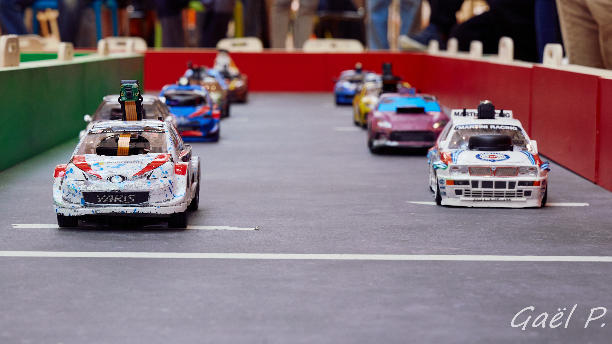

# Paris-Saclay Autonomous Car Race

Since 2020, the event has welcomed teams of students (from IUTs, engineer schools, universities) for a 1/10th scale autonomous car race, in a friendly and collaborative spirit. The prospect of final victory does not prevent teams from helping each other throughout the year with the aim of making collective progress.

The 1/10th scale autonomous cars are a fantastic platform for hands-on experimentation with artificial intelligence. Reinforcement learning, supervised learning, imitation learning, unsupervised learning—AI in all its forms meets in Saclay every April.

Feel free to join the competition!

</img>

## 2026 Edition Date

The 2026 edition will take place on Saturday, April 11th at ENS Paris-Saclay.

## Previous Editions

Summaries and videos of previous editions are available on the Culture Sciences de l'Ingénieur website:

* [2025 Edition](https://sti.eduscol.education.fr/si-ens-paris-saclay/actualites/course-voitures-autonomes-paris-sacaly-2025)

* [2024 Edition](https://sti.eduscol.education.fr/si-ens-paris-saclay/actualites/course-voitures-autonomes-paris-saclay-2024)

* [2023 Edition](https://sti.eduscol.education.fr/si-ens-paris-saclay/actualites/course-voitures-autonomes-2023-resultats)

* [2021 & 2022 Editions](https://sti.eduscol.education.fr/si-ens-paris-saclay/actualites/course-de-voitures-autonomes-2022-resultats)

</img>

## Git

The [Git repository](https://github.com/ajuton-ens/CourseVoituresAutonomesSaclay) provides the rules, some photos and videos, a bibliography, and all the resources needed to participate in the Paris-Saclay autonomous car race, as well as a place to share