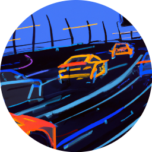
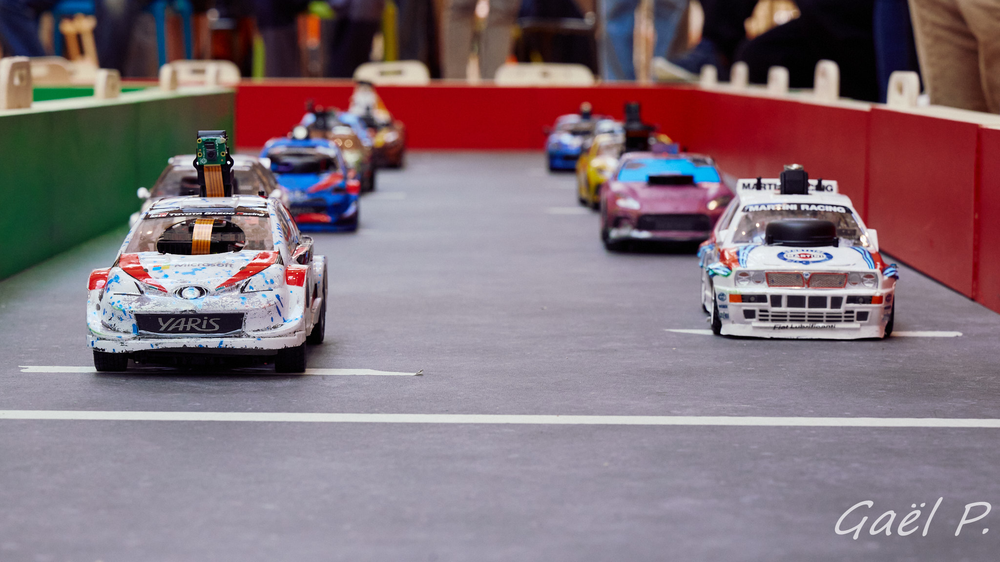

# Course de Voitures Autonomes de Paris-Saclay

L'événement accueille depuis 2020 des équipes d'étudiants (IUT, écoles d'ingénieurs, universités) pour une course de voitures 1/10ème autonomes, dans un esprit convivial et de collaboration. La perspective de la victoire finale n'empêche pas les équipes de s'entraider pendant l'année dans l'optique de progrès communs.

Les voitures autonomes 1/10ème sont un formidable support pour l'expérimentation concrète de l'intelligence artificielle. Apprentissage par renforcement, apprentissage supervisé, par imitation, apprentissage non supervisé, toute l'IA a rendez-vous à Saclay en avril.

N'hésitez pas à rejoindre la compétition.

</img>

## Date de l'édition 2027

L'édition 2027 aura lieu le samedi 3 avril à l'ENS Paris Saclay.

## Editions précédentes

Des résumés et des vidéos des éditions précédentes, ainsi que des guides pour démarrer (premiers programmes python, prise en main du simulateur, apprentissage par renforcement, ROS2...) sont disponibles sur le site de Culture Sciences de l'Ingénieur : [Dossier CoVAPSy Culture Sciences de l'ingénieur](https://sti.eduscol.education.fr/si-ens-paris-saclay/ressources_pedagogiques/dossier-course-de-voitures-autonomes)

</img>

## Git

Le [dépôt Git](https://github.com/ajuton-ens/CourseVoituresAutonomesSaclay) permet de trouver le réglement, quelques photos et vidéos, une bibliographie ainsi que l'ensemble des ressources pour participer à la course de voitures autonomes de Paris Saclay et d'y partager les siennes.