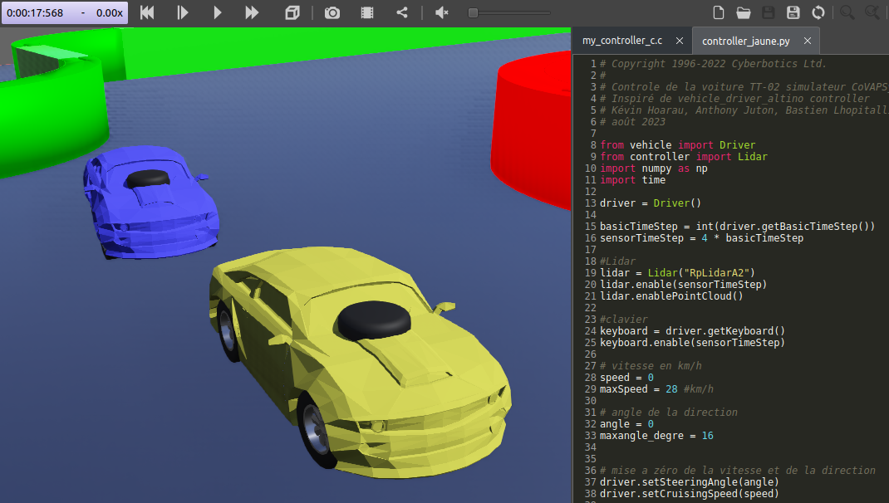

# Simulateur pour la course de voitures autonomes de Paris Saclay

Pour accélérer le développement d'algorithmes pour les voitures autonomes, plusieurs équipes utilisent des simulateurs, soit développés en interne (en python ou sous matlab), soit basés sur des simulateurs existants (AirSim, Webots,...)

Un partage des différentes expériences sur simulateur est souhaitée pour permettre le démarrage plus rapide des nouvelles équipes, voire des confrontations sur simulateur, avant la date de la course officielle.

Pour la saison 2023-2024, un projet webots 2023b avec une voiture type, un contrôleur basique en C et un en python et des éléments de la piste officielle est disponible sur le git, dans l'archive [Simulateur_CoVAPSy_Webots2023b](https://github.com/ajuton-ens/CourseVoituresAutonomesSaclay/blob/main/Simulateur/Simulateur_CoVAPSy_Webots2023b_Base.zip)

Un article Culture Sciences de l'ingénieur accompagne les premiers pas sur le simulateur (lien à venir)
