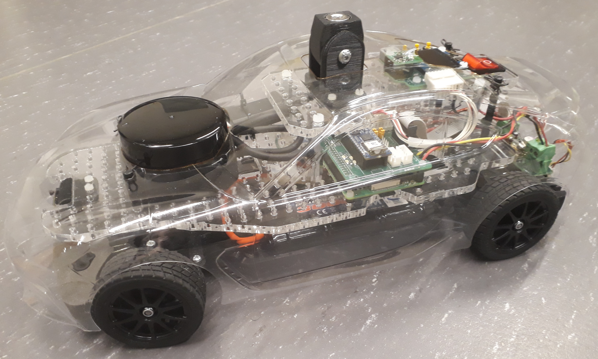
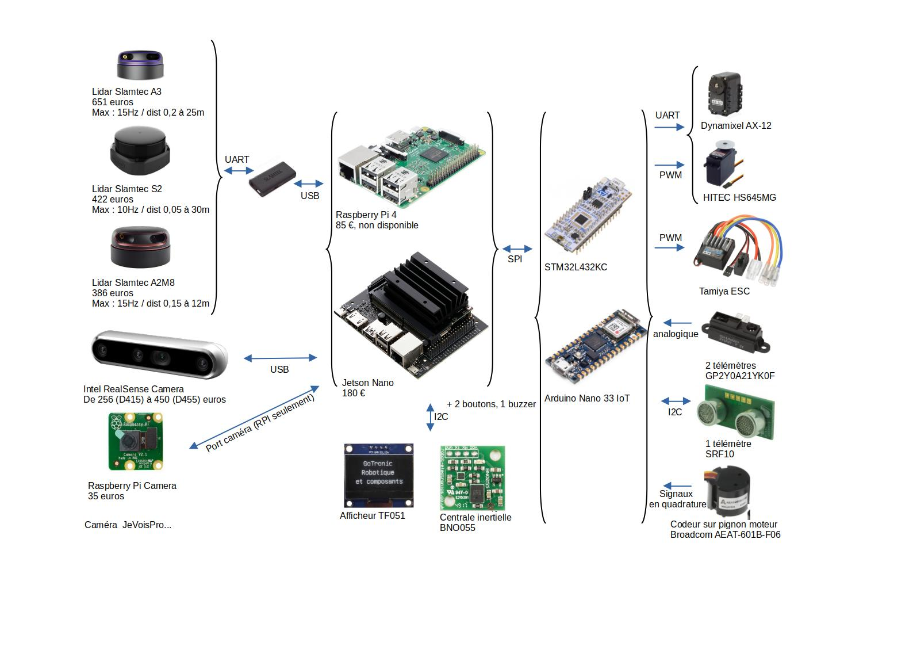

# Voiture type pour la course de voitures autonomes de Paris Saclay

Une voiture type est proposée pour la course de voitures autonomes. Le kit complet est disponible à la vente depuis janvier 2023, notamment pour des équipes sans moyens de fabrication mécanique et/ou électronique.
Cette voiture type n'est qu'un exemple pour aider les équipes à démarrer. Il ne demande qu'à être enrichi.

</img>

</img>

## Contrôle-commande

Le schéma synoptique de la partie contrôle-commande est le suivant, avec plusieurs possibilités de Lidars, caméras, nano-ordinateurs ou micro-contrôleurs : 

Une carte électronique de connexion de ces divers éléments est en cours de conception.

## La mécanique

Des pièces mécaniques dont les fichiers 3D seront fournis prochainement sur le git permettent d'adapter le châssis TT-02 à ces équipements de contrôle-commande. 

</img>

Outre les découpes propres de carrosserie, l'élément majeur de ce kit est l'ajout d'un codeur permettant d'obtenir une vitesse précise du moteur (éléments en rouge sur la figure ci-desssous)

</img>

Le kit propose notamment la possibilité d'utiliser un servo-moteur numérique AX-12 à la place du servo-moteur analogique standard.

</img>

Enfin, les pièces 3D permettent une fixation propre des capteurs à l'avant (caméra Raspberry) comme à l'arrière (télémètres IR et/ou ultrason).

</img>

## Liste du matériel

Voici une liste de matériel, de fournisseurs et de prix TTC indicatifs.

* Tamiya TT-02 Toyota GR 86 KIT	ref 58694 - RCTeam 58694 - 134,90 €
* Konect Servo 9kg 0.13s Digital KN-0913LVMG - RCTeam KN-0913LVMG - 19,90 €
* ORION Chargeur IQ801 1A - RCTeam ORI30197 - 15,90 €
* T2M Accu 7.2v Nimh 3000mah - RCTeam T1006300 - 27,30 €
								

* Raspberry Pi 4 modèle B - Kubii PI48GB - 94,50 €
* Câble officiel noir Micro-HDMI vers HDMI 1M - Kubii SC0270 - 4,80 €
* Carte Micro-SD Classe 10 32 GB - Kubii KG32_DEL - 8,94 €
* Alimentation Officielle pour Raspberry Pi 4 15.3W USB-C - Kubii ALIMPI4 - 9,60 €
* Module Caméra v2 8MP - Kubii 2510728 - 25,80 €
* Nappe Cable pour Raspberry Pi Camera 30 cm - Kubii kub1645-PRD - 0,96 €

* Scanner à distance laser RPLIDAR A2M12 360 Slamtec A2-M12 - Roboshop RB-Rpk-22 - 269,03 €
* Câble USBA – microUSB 20 cm - RS 182-8869 - 3,14 €

* Module Sonar SRF10 Devantech - Roboshop RB-Dev-10 - 36,86 €
* 2 Capteurs de Distance GP2Y0A41SK0F IR Sharp - 4 à 30 cm - Roboshop RB-Dem-04 - 22,44 €
* Module d'Orientation Absolue 9 DOF BNO055	Devantech - Roboshop RB-Dev-91 - 31,73 €
* Module nano 33 IOT avec embases Arduino - RS 192-7589 - 25,98 €
* Fourche optique, avec câbles	OPTEK TECHNOLOGY OPB815WZ - Farnell 1497919 - 5,39 €

* **Total des modules sur étagère**								737,17 €

**Options :**

Jetson nano à la place de la Raspberry Pi : 

* Kit de développement NVIDIA Jetson Nano 4GB - Kubii DEV-4GB - 202,80 €		

STM32 à la place de la carte Arduino :

* Carte Nucleo STM32L432KC - Farnell 2580786 - 12,89 €		
* Câble USB RS PRO, Micro-USB B vers USB A, 0.5m - RS 236-9078 - 2,89 €	

Servomoteur numérique à la place du servomoteur analogique de direction :

* Servomoteur numérique Dynamixel AX-12 - Gotronic 36433 - 41 €

Caméra à placer sur le toit : 

* Caméra Realsense D435i - Digikey 2311-82635D435IDKMP-ND - 445,54 €
* Module HUSKYLENS DFROBOT SEN0305 - Farnell 3517863 - 65,30 €
* Module intégré Husky Lens Pro AI DFROBOT SN0336 - Farnell 3517864 - 89,10 €

Le CRIC propose l'ensemble des cartes électroniques de la voiture type pour 250 € et l'ensemble des pièces mécaniques pour 260 €
								
	

