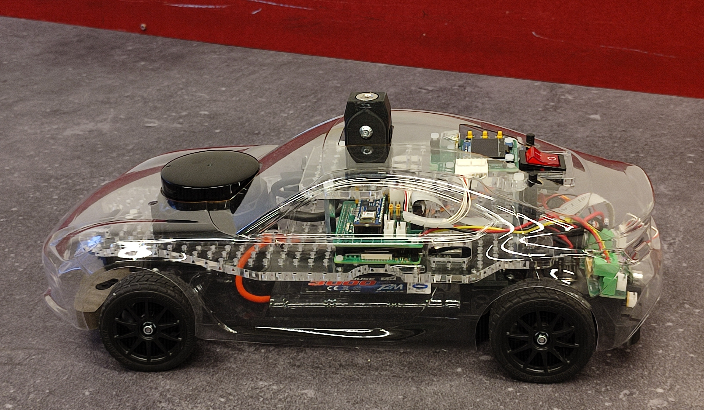
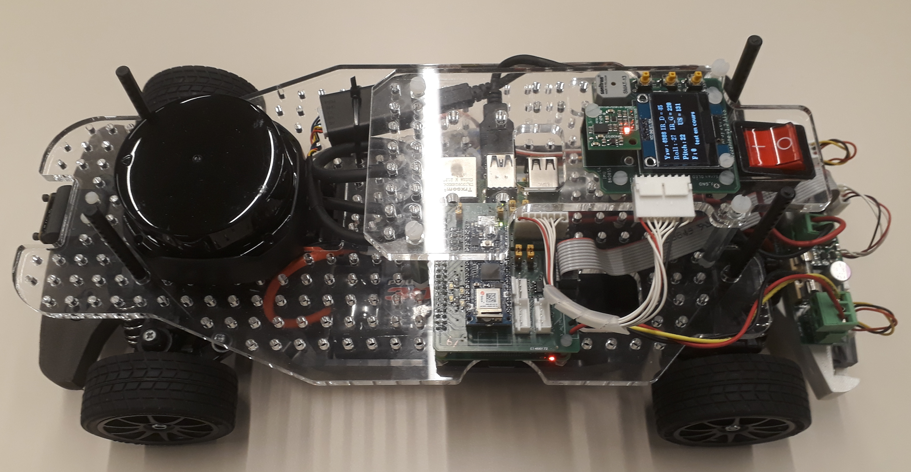
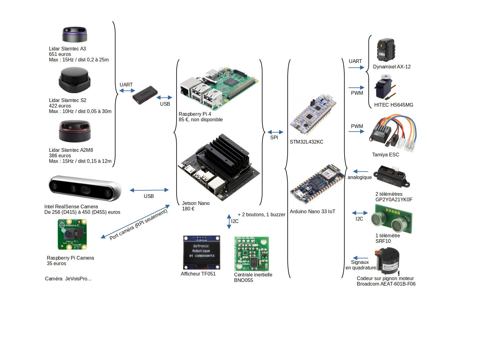
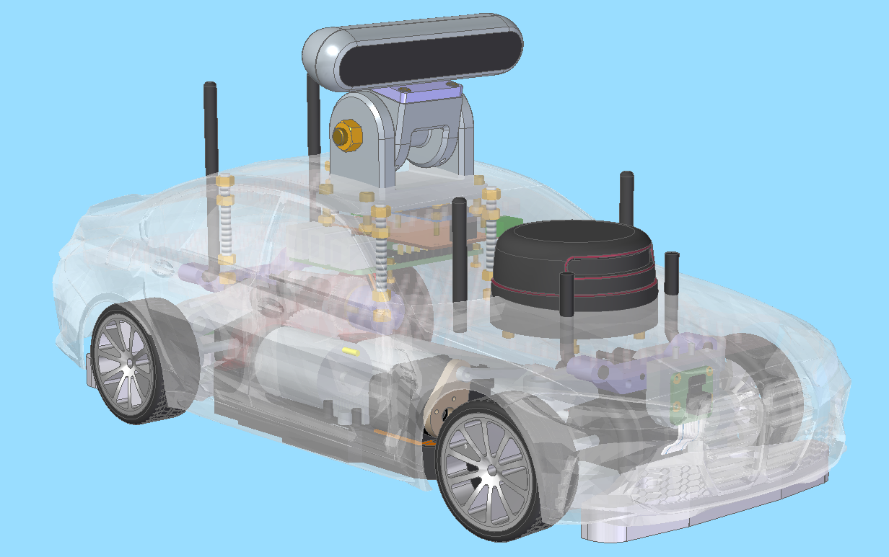
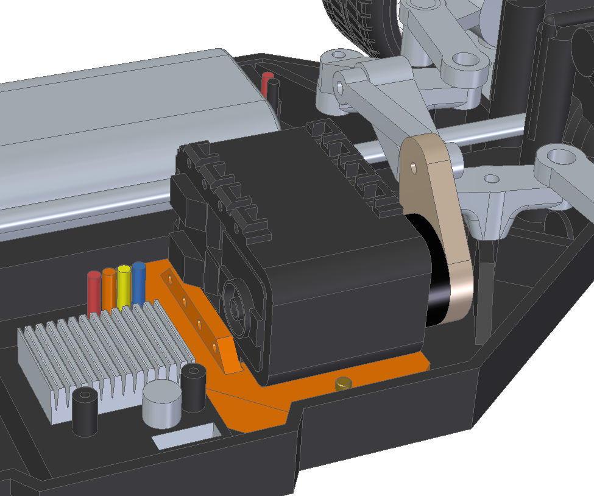
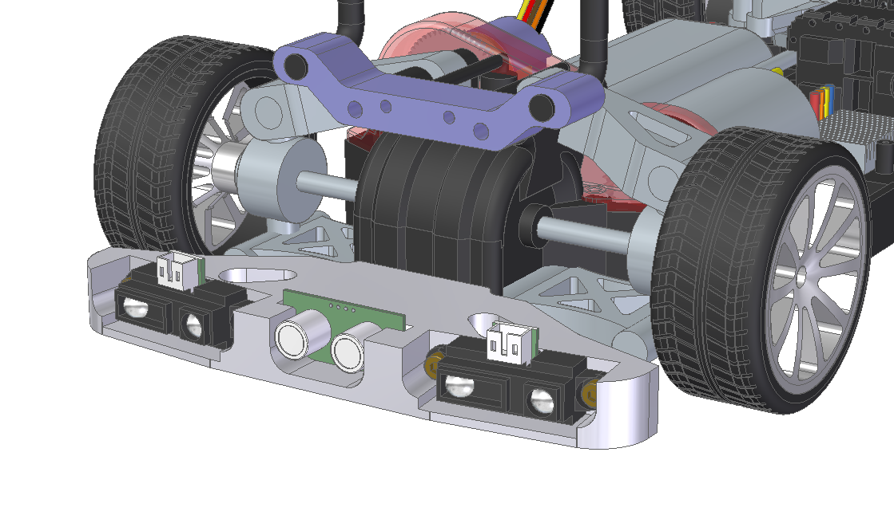

# Voiture type pour la course de voitures autonomes de Paris Saclay

Une voiture type est proposée pour la course de voitures autonomes. Le kit complet et le kit {cartes électroniques, pièces mécaniques spécifiques} sont disponibles à la vente depuis janvier 2023, notamment pour des équipes sans moyens de fabrication mécanique et/ou électronique.

Cette voiture type n'est qu'un exemple pour aider les équipes à démarrer. Il ne demande qu'à être enrichi.

</img>

</img>

## Contrôle-commande

Le schéma synoptique de la partie contrôle-commande est le suivant, avec plusieurs possibilités de lidars, caméras, nano-ordinateurs ou micro-contrôleurs : 

Les schémas électroniques au format Eagle et en pdf sont fournis dans le dossier _Hardware_ du [dépôt Git](https://github.com/ajuton-ens/CourseVoituresAutonomesSaclay)

## La mécanique

Des pièces mécaniques permettent d'adapter le châssis TT-02 à ces équipements de contrôle-commande. Les fichiers stl sont fournis dans le dossier _Hardware_ du [dépôt Git](https://github.com/ajuton-ens/CourseVoituresAutonomesSaclay)

</img>

Outre les découpes propres de carrosserie, l'élément majeur de ce kit est la modification de la roue dentée de l'axe de transmission, l'ajout d'une fourche optique et d'un nouveau carter pour permettre la mesure de la vitesse du moteur.

Le kit propose notamment la possibilité d'utiliser un servo-moteur numérique AX-12 à la place du servo-moteur analogique standard.

</img>

Enfin, les pièces 3D permettent une fixation propre des capteurs à l'avant (caméra Raspberry) comme à l'arrière (télémètres IR et/ou ultrason).

</img>

## Liste du matériel version 2021

Voici une liste de matériel, de fournisseurs et de prix TTC indicatifs.

* Tamiya TT-02 Toyota GR 86 KIT	ref 58694 - RCTeam 58694 - 134,90 €
* Konect Servo 9kg 0.13s Digital KN-0913LVMG - RCTeam KN-0913LVMG - 19,90 €
* ORION Chargeur IQ801 1A - RCTeam ORI30197 - 15,90 €
* T2M Accu 7.2v Nimh 3000mah - RCTeam T1006300 - 27,30 €
								

* Raspberry Pi 4 modèle B - Kubii PI48GB - 94,50 €
* Câble officiel noir Micro-HDMI vers HDMI 1M - Kubii SC0270 - 4,80 €
* Carte Micro-SD Classe 10 32 GB - Kubii KG32_DEL - 8,94 €
* Alimentation Officielle pour Raspberry Pi 4 15.3W USB-C - Kubii ALIMPI4 - 9,60 €
* Module Caméra v2 8MP - Kubii 2510728 - 25,80 €
* Nappe Cable pour Raspberry Pi Camera 30 cm - Kubii kub1645-PRD - 0,96 €

* Scanner à distance laser RPLIDAR A2M12 360 Slamtec A2-M12 - Roboshop RB-Rpk-22 - 269,03 €
* Câble USBA – microUSB 20 cm - RS 182-8869 - 3,14 €

* Module Sonar SRF10 Devantech - Roboshop RB-Dev-10 - 36,86 €
* Module d'Orientation Absolue 9 DOF BNO055	Devantech - Roboshop RB-Dev-91 - 31,73 €
* Carte microcontrôleur Nucleo-G431KB - Farnell 3132398 - 10,89 €
* Câble USB RS PRO, Micro-USB B vers USB A, 0.5m - RS 236-9078 - 2,89 €	
* Fourche optique, avec câbles	OPTEK TECHNOLOGY OPB815WZ - Farnell 1497919 - 5,39 €

* **Total des modules sur étagère**								~725 €

## Liste du matériel version 2026

* Tamiya TT-02 Ford Mustang GT4 KIT ref 58664 - RCTEAM 58664 - 129,90 €
* Tamiya Pièce de Direction alu TT-02 54752 - RCTEAM 54752 - 67,20 €
* SkyRC Chargeur Nimh eN18 1.2A - RCTeam SK100184-01 - 19,90 €
* Robitronic Chargeur Peak Charger NiMh 1A - RCTEAM R01018 - 15,90 €
* Absima Batterie NIMH 7.2V 4200mAh - RCTeam 4100012 - 2 x 23,90 €

* Raspberry Pi 5 8 Go - Kubii - 204 €
* Ventilateur dissipateur officiel pour Raspberry Pi 5 - Kubii - 6 €
* Câble Micro-HDMI vers HDMI (type A) 1M pour PI4 - Kubii - 4,50 €
* Carte Micro-SD SanDisk Classe 10 - Kubii - 16,20 €
* Module caméra v3 Raspberry Pi grand angle - Kubii - 39 €
* Nappe Cable pour Raspberry Pi Camera 30 cm - Kubii - 2,40 €

* servomoteur HerkuleX DRS-0101 - Roboshop RB-Das-05 - 76,4 €
* SLAMTEC RPLIDAR C1 Scanner Laser DTOF 360°  - Roboshop RB-Rpk-35 - 75,3 €

* Module Sonar SRF10 Devantech - Gotronic 24506 - 19,90 €
* Carte microcontrôleur Nucleo-G431KB - Farnell 3132398 - 17,76 €
* Câble USB RS PRO, Micro-USB B vers USB A, 0.5m - RS 236-9078 - 2,86 €	
* Fourche optique, avec câbles	OPTEK TECHNOLOGY OPB815WZ - Farnell 1497919 - 4,54 €

* **Total des modules sur étagère**								~745 €

**Options :**

Il est possible de remplacer le nano-ordinateur Raspberry Pi par une carte GPU Jetson Orin. 

Qualcomm/Thundercomm propose aussi une carte similaire, la rubik Pi 3

Caméra RGBD à placer sur le toit : 

* Caméra Realsense D435i - Digikey 2311-82635D435IDKMP-ND - 445,54 €

La ménagerie technologique propose l'ensemble des cartes électroniques de la voiture type pour 350 € et l'ensemble des pièces mécaniques pour 250 €
								
	

